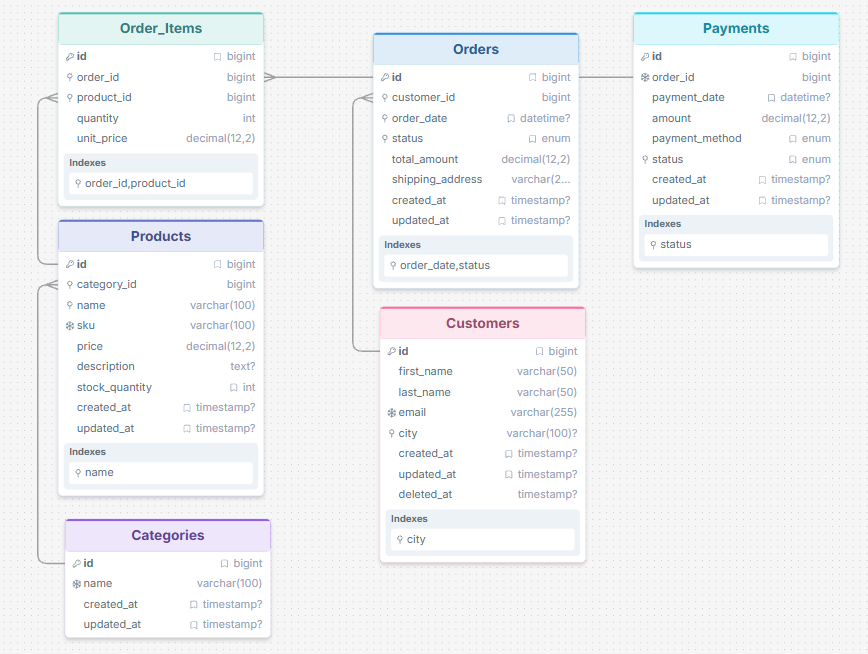

# E-commerce SQL Analytics

A practice project focused on relational database design, SQL querying, data analysis, and query optimization across different SQL database systems.

The project uses the same e-commerce domain to practice SQL and compare database-specific features and syntax between:

* MySQL
* Microsoft SQL Server

The database represents a simple e-commerce system with customers, products, categories, orders, order items, and payments.

---

## Project Goals

The main goals of this project are to practice:

* relational database design
* SQL querying
* data analysis
* joins and aggregations
* subqueries and CTEs
* window functions
* query optimization
* database-specific SQL dialects
* data generation and loading
* working with multiple relational database systems

---

## Database Systems

### MySQL

MySQL is the original implementation of the project.

It contains the complete set of SQL practice queries, database design, data generation, verification, and query optimization exercises.

[View MySQL project](mysql/)

### Microsoft SQL Server

The SQL Server implementation adapts the same database and analytical tasks to T-SQL and adds SQL Server-specific features.

[View MS SQL project](mssql/)

---

## Project Structure

```text
.
├── data-generator/
│   ├── README.md
│   ├── requirements.txt
│   └── generate_data.py
│
├── mysql/
│   ├── docker-compose.yml
│   ├── README.md
│   ├── schema.sql
│   ├── verify.sql
│   └── queries/
│
├── mssql/
│
├── docs/
│   ├── er_diagram.png
│   └── mysql/
│
└── README.md
```

---

## Database Schema

The project uses the same e-commerce data model across the supported database systems.

Main entities:

* Customers
* Categories
* Products
* Orders
* Order_Items
* Payments

ER diagram:



Main relationships:

* One customer can have many orders
* One order can contain many products
* Products belong to categories
* Orders can have payments

---

## SQL Topics

The project covers both common SQL concepts and database-specific features.

### Core SQL

* SELECT
* WHERE
* ORDER BY
* DISTINCT
* filtering
* string functions
* numeric functions
* JOINs
* GROUP BY
* HAVING
* subqueries
* EXISTS / NOT EXISTS
* CTEs
* window functions

### Analytics

* aggregations
* ranking
* running totals
* comparisons between rows
* customer analysis
* product analysis
* sales analysis

### Database Features

Depending on the database system, the project also covers:

* constraints
* indexes

---

## Data Generation

The project includes a Python-based data generator for creating realistic test data.

The generated data is used to populate the database and practice SQL queries on a larger dataset.

See:
[data-generator/](data-generator/)

---

## Learning Approach

The project follows a comparative approach.

The same analytical tasks are implemented across different database systems to identify:

1. SQL syntax that is common across databases
2. differences between SQL dialects
3. database-specific features

This makes it possible to practice SQL while also understanding the differences between MySQL and SQL Server.

---

## Technologies

* SQL
* MySQL
* Microsoft SQL Server
* Python
* Git

---

## Repository Purpose

This repository is primarily a learning and portfolio project demonstrating practical SQL skills, relational database design, analytical querying, and the ability to work with multiple SQL database systems.