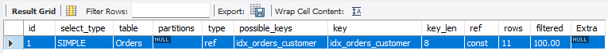
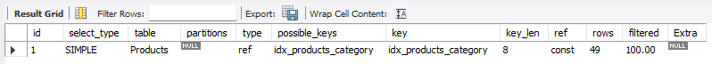
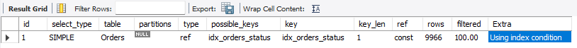
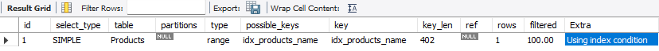
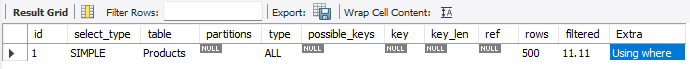
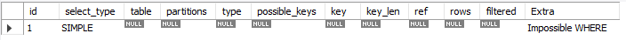
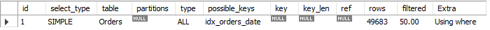
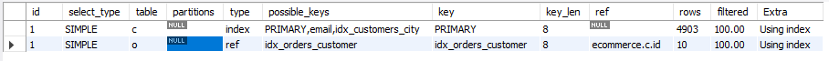

# Task 1
## Find all orders for customer customer_id = 10. Use EXPLAIN to verify whether an index is used

```sql
EXPLAIN SELECT *
FROM Orders
WHERE customer_id=10;
```



EXPLAIN shows that the index `idx_orders_customer` is being used.
The access type is `ref`, as the search is performed based on an equality condition (`=`) using a non unique secondary index.
The `rows` value of 11 indicates that the optimizer expects to read approximately 11 rows matching `customer_id = 10`. This is significantly more efficient than a full table scan.
If the distribution of orders among customers is relatively uniform, using the index is optimal.

---

# Task 2
## Find all products in category category_id = 3. Analyze the execution plan using EXPLAIN

```sql
EXPLAIN SELECT *
FROM Products
WHERE category_id=3;
```



The index `idx_products_category` is used.
The access type is `ref`, as the search is performed using a non unique index based on an equality condition.
The optimizer estimates that approximately 49 rows will be read. This indicates that the category contains a relatively small number of products, making the use of the index justified.
If the majority of products belonged to this category, the efficiency of such an index would be significantly lower.

---

# Task 3
## Find all orders with status PAID. Check whether the status index is used

```sql
EXPLAIN SELECT * 
FROM Orders
WHERE status='PAID';
```



MySQL uses the index `idx_orders_status`. 
The access type is `ref`, indicating a lookup using a non unique index. 
The optimizer estimates that approximately 9,966 rows will be read. Although the index is used, its selectivity is very low, offering little benefit if the total number of rows in the table is close to this estimate. In some cases, a full table scan might be faster due to the high number of transitions between the index and the table rows. 
The `Extra` column shows `Using index condition`, meaning MySQL is employing Index Condition Pushdown to optimize filtering during the index scan. This allows part of the `WHERE` clause to be evaluated while reading the index, thereby reducing the number of accesses to the actual table rows.

---

# Task 4
## Find all products whose name starts with Mac. Explain why an index can be used

```sql
EXPLAIN SELECT *
FROM Products
WHERE name LIKE 'Mac%';
```



MySQL uses the index `idx_products_name`.
The access type is `range` because the condition `LIKE 'Mac%'` specifies a contiguous range of values ​​within the B-tree index.
MySQL can determine the start of the range ('Mac') and sequentially scan the index until the end of that range.
Thanks to the fixed prefix, there is no need to scan all rows in the table.

---

# Task 5
## Find all products whose name contains Mac. Explain why this query is usually slower

```sql
EXPLAIN
SELECT *
FROM Products
WHERE name LIKE '%Mac%';
```



In this case, it is not possible to use an index.
The `%` symbol at the beginning of the pattern means there is no fixed starting point for the string, so a B-tree index cannot determine the search range.
As a result, MySQL performs a full table scan (`type = ALL`) and checks the condition for every row (Using where).
This is precisely why such a query typically runs much more slowly, especially on large tables.


# Task 6
## Find all orders placed in 2025. <br> Compare: YEAR(order_date) and date range (BETWEEN) <br> Determine which query is more efficient.

```sql
EXPLAIN
SELECT *
FROM Orders
WHERE YEAR(order_date)=2025;
```



The first query performs a full table scan because the `YEAR()` function is applied to the indexed column. Since MySQL must evaluate the function for every row, the B-tree index on `order_date` cannot be used.


```sql
EXPLAIN
SELECT *
FROM Orders
WHERE order_date 
BETWEEN '2025-01-01' AND '2025-12-31';
```



The second query uses a sargable range predicate (BETWEEN), which allows MySQL to use the `order_date index`. However, in this execution plan the optimizer still chooses a full table scan `(type = ALL)`, `(key = NULL)`. This is because the query returns a large portion of the table.

---

The range predicate is generally more efficient because it allows index range scans. In this particular dataset, however, MySQL estimates that a full table scan has a lower execution cost


# Task 7
## Retrieve all customers together with their order count. <br> Use EXPLAIN and identify which indexes are used in the join.

```sql
EXPLAIN
SELECT c.id, COUNT(o.id)
FROM customers c
LEFT JOIN orders o
    ON c.id=o.customer_id
GROUP BY c.id;
```



EXPLAIN shows that MySQL scans the customers table using the PRIMARY index (type = index). Since the query groups only by the primary key and selects only `c.id`, the primary index covers all required columns from the customers table. Therefore, the optimizer performs a covering index scan (Using index).

The orders table is accessed using the `idx_orders_customer` index with the `ref` access type. For each customer, MySQL efficiently looks up matching orders using the join condition `o.customer_id = c.id`.

The optimizer estimates approximately 10 matching orders per customer `(rows = 10)`.